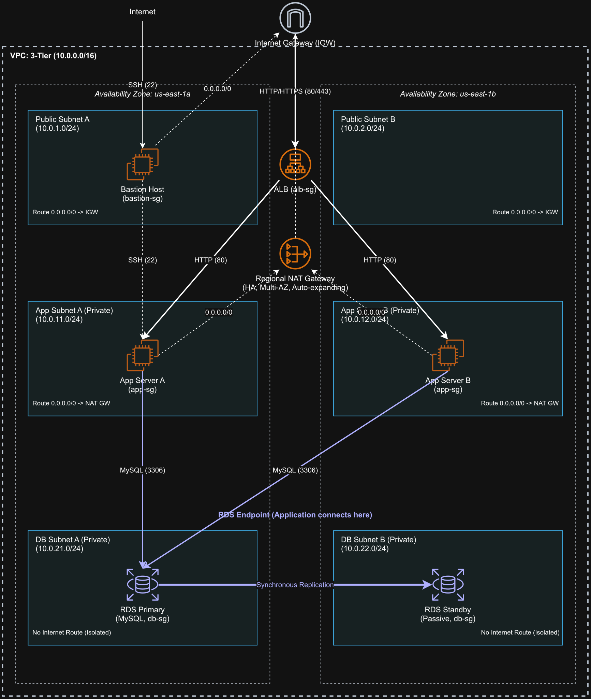
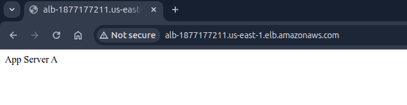
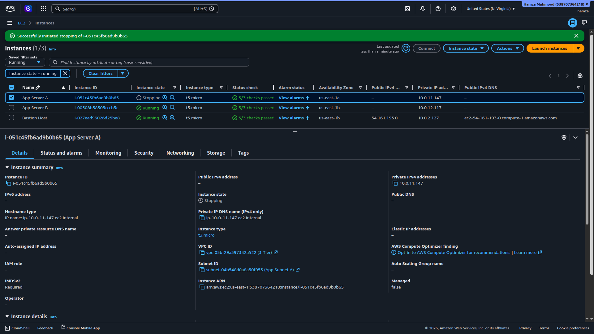
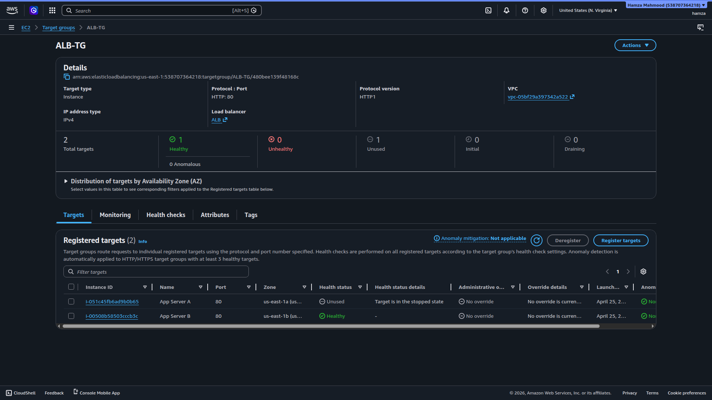
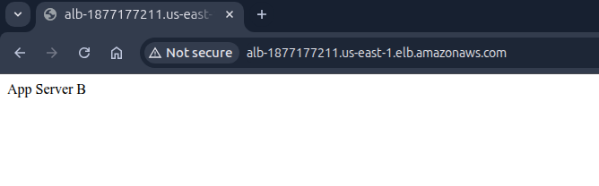
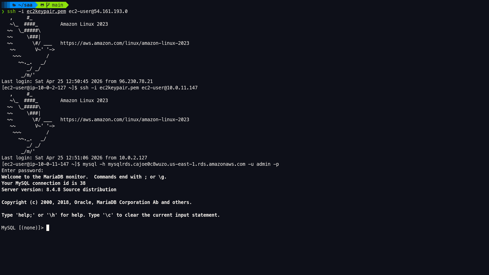
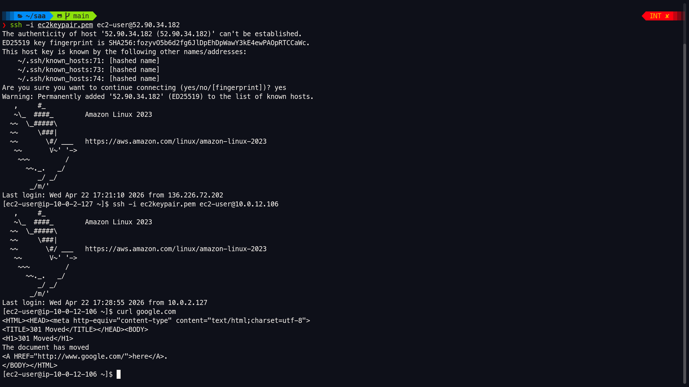
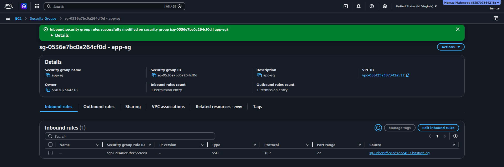
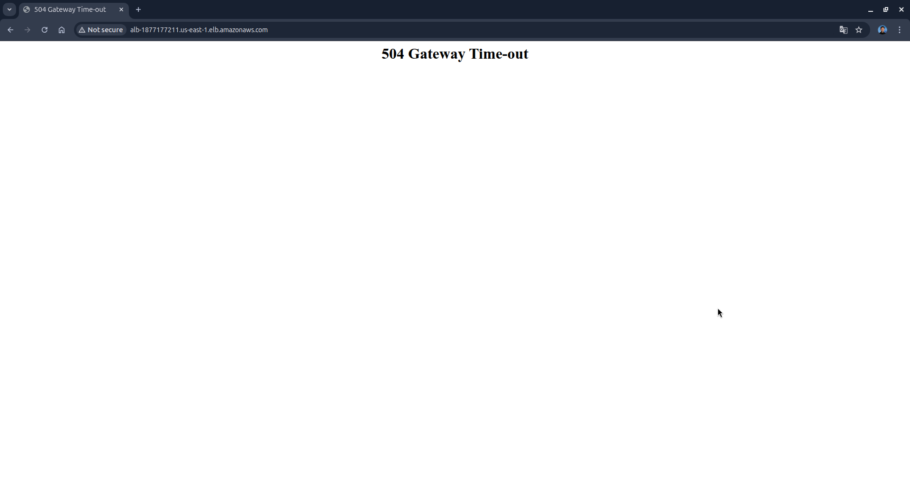

# AWS VPC 3-Tier Architecture

## Architecture Diagram

This project implements a highly available 3-tier architecture in AWS using a custom VPC.  
Traffic enters through an Application Load Balancer, is distributed across EC2 instances in private subnets, and connects to a Multi-AZ RDS MySQL database.  
Outbound internet access is handled via a Regional NAT Gateway, while the database layer remains isolated.

---

## Key Design Decisions

- **Multi-AZ Design**  
  Resources are distributed across two Availability Zones for high availability.

- **Subnet Segmentation**  
  The VPC is structured into the following subnet layers:
  - Public Subnet A (10.0.1.0/24) – us-east-1a
  - Public Subnet B (10.0.2.0/24) – us-east-1b
  - Private App Subnet A (10.0.11.0/24) – us-east-1a
  - Private App Subnet B (10.0.12.0/24) – us-east-1b
  - Private DB Subnet A (10.0.21.0/24) – us-east-1a
  - Private DB Subnet B (10.0.22.0/24) – us-east-1b

- **Route Table Design**
  - Public Route Table → 0.0.0.0/0 → Internet Gateway  
  - Private App Route Table → 0.0.0.0/0 → Regional NAT Gateway  
  - Private DB Route Table → No internet route (fully isolated)

- **Security Group Chaining**
  - **sg-alb** → Allows HTTP (80) and HTTPS (443) from 0.0.0.0/0  
  - **sg-app** → Allows HTTP (80) from sg-alb and SSH (22) from sg-bastion  
  - **sg-db** → Allows MySQL (3306) from sg-app only  
  - **sg-bastion** → Allows SSH (22) from all internet (0.0.0.0/0)  

- **RDS Multi-AZ Deployment**  
  Primary in us-east-1a, standby in us-east-1b with synchronous replication and automatic failover.

- **Regional NAT Gateway**  
  Provides outbound internet access for private application subnets across both AZs.

---

## Deployment Steps

1. Created VPC (10.0.0.0/16) with DNS enabled  
2. Created 6 subnets across 2 AZs (public, app, db tiers)  
3. Configured Internet Gateway and route tables  
4. Created:
   - Public Route Table
   - Private App Route Table
   - Private DB Route Table  
5. Configured Regional NAT Gateway for outbound traffic  
6. Defined security groups (sg-alb, sg-app, sg-db, sg-bastion)  
7. Created EC2 instances using user data script:
   - Installed Apache (httpd)
   - Generated dynamic index.html for instance identification  
8. Launched Bastion Host in public subnet for SSH access  
9. Deployed RDS MySQL (Multi-AZ)  
10. Configured Application Load Balancer and target groups  

---

## Load Balancing Validation

Traffic is distributed across both App Server A and App Server B via the ALB.

---

## Instance Failure Simulation

  
  

After stopping one instance, traffic continued to be served by the remaining healthy instance.

---

## App → RDS Connectivity

Application instances successfully connect to the RDS endpoint over port 3306 using private networking.

---

## Outbound Internet Access

Private app instances access the internet via the Regional NAT Gateway.

---

## Failure Scenarios

### ALB → App Security Group Misconfiguration

  

Removing the ALB security group from the app tier results in a 504 Gateway Timeout, demonstrating dependency on correct security group chaining.

---

## What This Project Demonstrates

- VPC design and subnet segmentation strategy  
- Public vs private subnet architecture  
- Route table-based traffic control  
- Security group-based least privilege networking  
- High availability across Availability Zones  
- Layer 7 load balancing using ALB  
- Multi-AZ RDS design and failover handling  
- Infrastructure validation through controlled failure testing  
- EC2 automation using user data scripts (Apache + dynamic web content)

---

## Supporting Artifacts

This repository includes supporting materials used to validate and document the deployment:

- **[screenshots/](./screenshots/)**  
  Contains evidence of architecture behavior, including load balancing, failover testing, database connectivity, NAT gateway routing, and security group validation.

- **[configs/](./configs/)**  
  Contains the EC2 user data scripts used to initialize and configure application instances during deployment, including:
  - Apache (httpd) installation  
  - Dynamic `index.html` generation for instance-level identification  

These artifacts provide reproducibility and verification of the implemented 3-tier architecture.